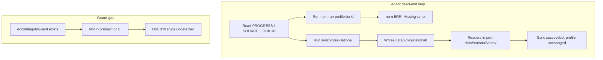
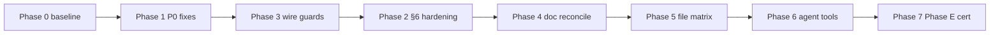

# Ledger Recovery & Agent-Efficiency Plan

## Situation diagnosis (verified root causes)

The last 6 hours of "error codes and dead ends" are not one bug — they are **stacked operational failures** where agents follow docs that point at commands, paths, or policies that do not exist or contradict each other. Build can pass while **data pipelines silently write to orphan locations**.




| Severity     | Issue                                                                                  | Evidence                                                                                                                                                                                                                                                      |
| ------------ | -------------------------------------------------------------------------------------- | ------------------------------------------------------------------------------------------------------------------------------------------------------------------------------------------------------------------------------------------------------------- |
| **P0 ✅**    | `MapClient.tsx` orphan + `USAMap.tsx` broken imports (`0086418`)                       | **Fixed 2026-07-05 (this agent).** MapClient was never imported; `[MapExplorer.tsx](components/map/MapExplorer.tsx)` already does `dynamic(() => import('./USAMap'), { ssr: false })` with props. Same commit removed PoliticianAvatar/OfficialCard/FloridaRecordPanel imports while JSX still used them. Deleted MapClient; restored imports in USAMap. |
| **P0**       | `profile:build` documented everywhere, **missing from** `[package.json](package.json)` | Referenced in PROGRESS M1/E, SOURCE_LOOKUP, BATCH_SCALING, profile-build.ts header                                                                                                                                                                            |
| **P0**       | National sync **writes wrong paths**                                                   | `[sync-votes-national.ts](scripts/sync-votes-national.ts)` → `data/votes/national/`; readers in `[nationalCongressVotes.ts](lib/data/nationalCongressVotes.ts)` → `data/national/votes/`                                                                      |
| **P0**       | Same FEC path drift                                                                    | `[sync-fec-national.ts](scripts/sync-fec-national.ts)` → `data/fec/national/`; `[nationalFecFinance.ts](lib/data/nationalFecFinance.ts)` → `data/national/fec/`                                                                                               |
| **P0**       | Phantom npm script `sync:congress-votes`                                               | Cited in ARCHITECTURE, SETUP, lib/data/README — **does not exist** (real: `sync:votes`, `sync:votes-national`)                                                                                                                                                |
| **P1**       | §6 checkpoint-on-failure                                                               | `[sync-stock-trades.ts](scripts/sync-stock-trades.ts)` L216/L246: `checkpoint[p.id] = true` even after House catch; Senate L235 overwrites prior trades with `[]` on error                                                                                    |
| **P1**       | Orphan guards not wired                                                                | `[docsIntegrityGuard.test.ts](scripts/__tests__/docsIntegrityGuard.test.ts)`, `[dataLayoutGuard.test.ts](scripts/__tests__/dataLayoutGuard.test.ts)`, `[envTruthGuard.test.ts](scripts/__tests__/envTruthGuard.test.ts)` exist but are **not** in prebuild/CI |
| **P1**       | Policy contradictions cause hesitation                                                 | core-rules "commit immediately" vs OWNER_SETUP "agent will not commit" vs Cursor user rule "commit only when asked"                                                                                                                                           |
| **P2**       | Stale PROGRESS                                                                         | Says 6/537 migrated + Phase E "awaiting approval"; disk has **7** profiles including `[P000197/manifest.json](lib/data/generated/profiles/P000197/manifest.json)` (Phase E artifact already exists)                                                           |
| **P2**       | Git divergence                                                                         | `main` **ahead 5** unpushed; dirty `PROGRESS.md` + `sourceIntegrity.ts`; 3 local `cursor/cloud-agent-`* branches                                                                                                                                              |
| **Upstream** | Senate eFD HTTP 503                                                                    | Documented honest gap — not fixable locally; House PTR works (97 members in snapshot)                                                                                                                                                                         |


**Agent ownership (2026-07-05):** This recovery plan is executed by **one local agent only** — no parallel cloud agents. Stock-trades hardening from commit `768051d` is already on `main`; apply remaining §6 checkpoint fixes in Phase 2A without re-implementing preload/retry/lock.

**Cloud agent coordination (historical):** Commit `0086418` attempted a MapClient SSR wrapper but never wired it and accidentally stripped USAMap imports — resolved in Phase 0B below.

---

## Phase 0B — MapClient / USAMap fix ✅ DONE

**Root cause (commit `0086418`):** A prior agent added `[components/map/MapClient.tsx](components/map/MapClient.tsx)` as an SSR boundary but never imported it anywhere. The live homepage uses `[app/page.tsx](app/page.tsx)` → `[MapExplorer](components/map/MapExplorer.tsx)`, which already dynamically loads USAMap with `{ ssr: false }` and passes `MapExplorerDataProps`. MapClient would have rendered USAMap **without props** if wired — incorrect.

The same commit removed three imports from `[USAMap.tsx](components/map/USAMap.tsx)` while JSX still referenced `PoliticianAvatar`, `OfficialCard`, `FloridaRecordPanel`, and `FloridaStateEconomicPanel` — a latent compile/runtime failure the other agent hit.

**Changes applied:**

| Action | File |
| ------ | ---- |
| Delete dead wrapper | `components/map/MapClient.tsx` (removed) |
| Restore imports | `components/map/USAMap.tsx` — PoliticianAvatar, OfficialCard, FloridaRecordPanel |

**Map stack (canonical — do not add MapClient back):**

```
app/page.tsx (server)
  └─ MapExplorer (client, dynamic USAMap ssr:false, passes mapProps)
       └─ USAMap (client, react-simple-maps)
```

**Future guard (Phase 3):** Add optional `orphanComponentGuard` — fail build if a `'use client'` default export under `components/` has zero importers (excluding `page.tsx` re-exports).

---

## Phase 0 — Stop the bleeding (30 min, no code yet)

**Goal:** One known-good baseline before any new edits.

1. **Inventory cloud-agent work**
  - Compare local `main` (768051d) vs `origin/main` and the 3 `cursor/cloud-agent-*` branches.
  - Identify overlapping files: `sync-stock-trades.ts`, `housePtrClient.ts`, `senatePtrClient.ts`, `resilientFetch.ts`, `.github/workflows/refresh-data.yml`.
  - **Rule:** Cloud agent owns stock-trades resilience; local agent owns path drift + `profile:build` + doc reconciliation.
2. **Capture failure artifacts before retrying**
  - Read (do not delete) `/tmp/ledger-*.log` and checkpoint files:
    - `/tmp/ledger-sync-stock-trades-checkpoint.json`
    - `/tmp/ledger-sync-fec-national-checkpoint.json`
    - `/tmp/ledger-sync-news-rss-checkpoint.json`
    - `/tmp/ledger-profile-build.log`
  - Record which members were checkpointed-as-done despite failures — these explain "sync ran but nothing changed."
3. **Run read-only baseline verification** (tee all output)
  ```bash
   npm run test:docs-integrity 2>&1 | tee /tmp/ledger-docs-guard-baseline.log   # after wiring in Phase 2
   npm run build 2>&1 | tee /tmp/ledger-build-baseline.log
   tsx scripts/profile-build.ts -- --members P000197 --dry-run  # if flag exists; else inspect script
  ```
4. **Push alignment decision** (owner/Claude approval gate): after Phase 1–2 fixes pass build, push the 5 pending commits so cloud and origin share one history.

---

## Phase 1 — P0 dead-end fixes (unblock M1 Phase E + M2)

These four changes restore agent trust in documented commands.

### 1A. Wire `profile:build`

Add to `[package.json](package.json)`:

```json
"profile:build": "tsx scripts/profile-build.ts"
```

Verify: `npm run profile:build -- --members P000197` exits 0 (or produces structured depth report). Log to `/tmp/ledger-profile-build.log`.

### 1B. Fix national sync output paths (single source of truth)

Create `[scripts/lib/dataPaths.ts](scripts/lib/dataPaths.ts)` (or extend existing path constants) with canonical paths:

- `NATIONAL_VOTES_FILE` → `data/national/votes/congress-votes.json`
- `NATIONAL_FEC_FILE` → `data/national/fec/congress-finance.json`

Update writers **and** stale comments in:

- `[scripts/sync-votes-national.ts](scripts/sync-votes-national.ts)` — change `OUT_DIR` from `data/votes/national` → `data/national/votes`
- `[scripts/sync-fec-national.ts](scripts/sync-fec-national.ts)` — change `OUT_DIR` from `data/fec/national` → `data/national/fec`
- `[lib/data/memberProfile.ts](lib/data/memberProfile.ts)` — fix JSDoc paths (comments currently cite wrong paths)
- `[lib/data/DATA_INTEGRATION_PLAN.md](lib/data/DATA_INTEGRATION_PLAN.md)` — align with `data/national/*`

**Acceptance:** Run `sync:votes-national` on 1–2 test members; confirm `data/national/votes/congress-votes.json` mtime updates; migrated profile vote accessor reflects change without manual copy.

### 1C. Eliminate phantom `sync:congress-votes`

Global doc replace:

- `sync:congress-votes` → `sync:votes-national` (national merge for migrated profiles) or `sync:votes` (legacy `generated/congressVotes.json`) with a **decision table** in `[lib/data/SOURCE_LOOKUP.md](lib/data/SOURCE_LOOKUP.md)`

Files to update (minimum):

- `[ARCHITECTURE.md](ARCHITECTURE.md)`, `[docs/SETUP.md](docs/SETUP.md)`, `[lib/data/README.md](lib/data/README.md)`, `[lib/data/DATA_INTEGRATION_PLAN.md](lib/data/DATA_INTEGRATION_PLAN.md)`, `[.cursor/rules/ledger-build-workflow.mdc](.cursor/rules/ledger-build-workflow.mdc)`

Add SOURCE_LOOKUP decision table:


| Need                    | Command               | Output read by                            |
| ----------------------- | --------------------- | ----------------------------------------- |
| Legacy all-member votes | `sync:votes`          | `generated/congressVotes.json`            |
| Migrated profile votes  | `sync:votes-national` | `data/national/votes/congress-votes.json` |
| Migrated profile FEC    | `sync:fec-national`   | `data/national/fec/congress-finance.json` |


### 1D. Post-data-change chain (document once, use everywhere)

Canonical chain in SOURCE_LOOKUP + AGENT_INDEX:

```
sync:legislators → verify:office → [category syncs] → npm run build
```

---

## Phase 2 — Data integrity hardening (§6 compliance)

Reference pattern: `[sync-news-rss.ts](scripts/sync-news-rss.ts)` (status-aware checkpoints, prior-data preservation).

### 2A. Stock trades (coordinate with cloud agent)

**Only if not already fixed on merged branch:**


| File                                                           | Fix                                                                                                       |
| -------------------------------------------------------------- | --------------------------------------------------------------------------------------------------------- |
| `[scripts/sync-stock-trades.ts](scripts/sync-stock-trades.ts)` | Checkpoint `status: 'ok'                                                                                  |
| Same                                                           | Senate path: on `result.error`, preserve `entry.trades` from loaded snapshot; set `note` + `fetch-failed` |
| `[lib/data/housePtrClient.ts](lib/data/housePtrClient.ts)`     | When index year fetch fails, surface `fetch-failed` in meta — not silent empty index                      |
| Fixture                                                        | Append frozen bad/good examples to `[lib/data/__fixtures__/](lib/data/__fixtures__/)`                     |


### 2B. Checkpoint audit (all sync scripts)

Apply the news-rss checkpoint pattern to:


| Script                                                       | Current risk                                                 |
| ------------------------------------------------------------ | ------------------------------------------------------------ |
| `[sync-topic-positions.ts](scripts/sync-topic-positions.ts)` | Checkpoints empty `memberTopics` as done (L1190)             |
| `[sync-votes-national.ts](scripts/sync-votes-national.ts)`   | Checkpoints under-filled members                             |
| `[sync-fec-national.ts](scripts/sync-fec-national.ts)`       | Checkpoints on partial success                               |
| `[sync-news-national.ts](scripts/sync-news-national.ts)`     | Bare `true` checkpoint                                       |
| `[sync-legislation.ts](scripts/sync-legislation.ts)`         | Writes empty `bills[]` on fetch failure — can wipe 120 bills |


**Standard checkpoint shape:**

```typescript
checkpoint[id] = { status: 'ok' | 'fetch-failed' | 'fetch-blocked', count?: number, error?: string };
// Skip retry only when status === 'ok'
```

### 2C. Florida ingest timeouts (core-rules §5 violation)

Replace raw `fetch()` with timeout wrapper in:

- `ingest-news-florida.ts`, `ingest-voteview-florida.ts`, `ingest-gdelt-florida.ts`, `ingest-fllobbyist-florida.ts`, `ingest-census-florida.ts`

Use `[scripts/lib/ingest-utils.ts](scripts/lib/ingest-utils.ts)` `fetchJson()` (30s default) or `[scripts/lib/resilientFetch.ts](scripts/lib/resilientFetch.ts)`.

---

## Phase 3 — Wire orphan guards into build + CI

Add to `[package.json](package.json)` prebuild (before existing suites):

```json
"test:docs-integrity": "tsx --test scripts/__tests__/docsIntegrityGuard.test.ts",
"test:data-layout": "tsx --test scripts/__tests__/dataLayoutGuard.test.ts",
"test:env-truth": "tsx --test scripts/__tests__/envTruthGuard.test.ts"
```

Update prebuild chain and `[.github/workflows/guards.yml](.github/workflows/guards.yml)` to match.

**Expected immediate failures to fix in same commit:**

- `docsIntegrityGuard` will fail on `profile:build` + `sync:congress-votes` citations until Phase 1 completes
- `dataLayoutGuard` may flag references to orphan `data/votes/` and `data/fec/` paths in code comments — clean during Phase 1B

**Extend `docsIntegrityGuard`** (optional but high value): also scan `scripts/*.ts` headers for `npm run X` citations, not just `.md` files — `[profile-build.ts](scripts/profile-build.ts)` header cites missing script today.

---

## Phase 4 — Documentation & policy reconciliation

Single authoritative policy — eliminate agent hesitation loops.

### 4A. Commit policy (one paragraph, referenced everywhere)

**Canonical text** (in core-rules only; others link to it):

- Agents **commit locally** when work passes `npm run build` and task acceptance criteria.
- **Push to origin/main** only on explicit owner or Claude Code APPROVAL.
- Cursor user rule ("commit only when asked") overrides auto-commit for Cursor sessions — state this explicitly in `[OWNER_SETUP.md](OWNER_SETUP.md)` §2/§6 to stop contradiction.

### 4B. Session-start order (already partially fixed in b251fd3 — finish alignment)

One list across `[agent-ops.mdc](.cursor/rules/agent-ops.mdc)`, `[REPO.md](REPO.md)`, `[AGENTS.md](AGENTS.md)`, `[docs/AGENT_INDEX.md](docs/AGENT_INDEX.md)`:

1. core-rules → 2. PROGRESS → 3. SOURCE_LOOKUP → 4. KEYS → 5. PILOT_PROFILE_CHECKLIST → 6. REPO → 7. AGENT_INDEX

### 4C. Credibility escalation

Fix `[.cursor/rules/agent-ops.mdc](.cursor/rules/agent-ops.mdc)`: credibility tradeoffs route to **Claude Code**, not owner (match AGENTS.md).

### 4D. PROGRESS.md status board refresh

Update in same commit as Phase E verification:

- M1: D1–D4 ✅; **Phase E: in review** (P000197 artifact exists — do not re-run from scratch)
- Migrated: **7 profile dirs** (6 gold + P000197 cert candidate)
- Include stock-trades/CI rows from uncommitted diff
- Mark M1 DONE only after Phase E passes Claude review

### 4E. Deprecate stale doc traps

Add "DO NOT USE for current policy" banner to:

- `[docs/STATE_COUNTY_EXPANSION.md](docs/STATE_COUNTY_EXPANSION.md)` (hand-authored / Tier 1/2 language)
- `[FUTURE_ROADMAP.md](FUTURE_ROADMAP.md)` where tier labels conflict

Update `[lib/data/DATA_INTEGRATION_PLAN.md](lib/data/DATA_INTEGRATION_PLAN.md)`: stock-trades is **partial live** (97 members), not empty stub.

### 4F. Expand AGENT_INDEX

Add rows for: `CLAUDE.md`, `agent-ops.mdc`, `ledger-build-workflow.mdc`, `scripts/profile-build.ts`, npm command decision table, `/tmp/ledger-*.log` conventions.

---

## Phase 5 — Exhaustive file review matrix

Review every file category systematically. For each file: **(R)** read path, **(W)** write path, **(G)** guard coverage, **(D)** doc citation accuracy, **(§6)** failure-overwrite behavior.

### 5A. Scripts (`scripts/` — 40+ files)


| Category             | Files                                                                                                                  | Review focus                                                   |
| -------------------- | ---------------------------------------------------------------------------------------------------------------------- | -------------------------------------------------------------- |
| **National sync**    | sync-votes-national, sync-fec-national, sync-fec-schedule-a*, sync-stock-trades, sync-legislation                      | Output paths, checkpoints, §6, timeouts                        |
| **Profile pipeline** | profile-build, apply-crec-sync-to-profiles, reprocess-topic-positions-bundle, lib/profileMigrate, lib/profileReprocess | End-to-end chain, guard invocation                             |
| **CREC / positions** | sync-topic-positions                                                                                                   | Empty checkpoint, GovInfo rate limits                          |
| **News**             | sync-news-rss (gold standard), sync-news-national, sync-profile-news                                                   | Prior preservation                                             |
| **Florida ingest**   | 20+ `ingest/florida/`*                                                                                                 | Timeout gaps, key requirements                                 |
| **Verify**           | verify-office-resolution, verify-lobbying-votes (stub)                                                                 | Coverage vs PILOT checklist                                    |
| **Refresh helpers**  | refresh-senate-cast-votes, refresh-migrated-profile-votes                                                              | Already use correct `data/national/`* paths — use as reference |
| **Infra**            | lib/resilientFetch, lib/syncLock, lib/ingest-utils                                                                     | Shared by all syncs                                            |


### 5B. Data accessors (`lib/data/*.ts`)


| File                                                                                                                       | Risk                                                                                     |
| -------------------------------------------------------------------------------------------------------------------------- | ---------------------------------------------------------------------------------------- |
| `[topicPositions.ts](lib/data/topicPositions.ts)`                                                                          | Dual read path during migration — agents edit wrong layer                                |
| `[memberProfile.ts](lib/data/memberProfile.ts)`                                                                            | Manual static imports per member — does not scale to 537; document migration requirement |
| `[nationalCongressVotes.ts](lib/data/nationalCongressVotes.ts)`, `[nationalFecFinance.ts](lib/data/nationalFecFinance.ts)` | Correct read paths — sync writers must match                                             |
| `[sourceIntegrity.ts](lib/data/sourceIntegrity.ts)`                                                                        | Uncommitted vote-restatement filter — commit with guard fixture                          |


### 5C. Generated data (`lib/data/generated/`)


| Area                         | Action                                              |
| ---------------------------- | --------------------------------------------------- |
| `profiles/` (7 members)      | Spot-verify P000197 vs gold S000033 checklist       |
| `topicPositions.json`        | Track retirement progress; no new facts into bundle |
| `stockTrades.json`           | Verify meta reflects Senate 503 honest gap          |
| `members/` (538 deep ingest) | Confirm not imported by UI incorrectly              |


### 5D. App layer (`app/`, `components/`)

- Route pages remain server components (no `'use client'` on `page.tsx`)
- Client bundle guard: no runtime import of generated JSON
- Profile components match locked layout numbers (117/120/80 char limits per core-rules §4)
- **Map stack:** MapExplorer is the sole SSR boundary for USAMap — no duplicate MapClient wrapper (Phase 0B ✅)
- Scan for other orphan `'use client'` components with zero importers (same failure mode as MapClient)

### 5E. CI / GitHub Actions


| Workflow                                                                   | Review                                                                                      |
| -------------------------------------------------------------------------- | ------------------------------------------------------------------------------------------- |
| `[.github/workflows/guards.yml](.github/workflows/guards.yml)`             | Add orphan guards                                                                           |
| `[.github/workflows/refresh-data.yml](.github/workflows/refresh-data.yml)` | `exclude-fetch-failed-artifacts.sh`; consider adding stock-trades on schedule post-Phase 2A |
| Secrets                                                                    | `[scripts/setup-github-secrets.sh](scripts/setup-github-secrets.sh)` vs KEYS.md SET list    |


### 5F. Rules & docs (`.cursor/rules/`, `docs/`, root `*.md`)

Run `docsIntegrityGuard` + manual pass for: tier label bans, DNU/mock language, phantom npm scripts, archive warnings.

### 5G. Tests & fixtures (`scripts/__tests__/`, `lib/data/__fixtures__/`)

- Every Phase 2 fix gets an append-only fixture (core-rules §6)
- Golden snapshots: S000033, M000355 — run `snapshot:update` only when display pipeline change is intentional

---

## Phase 6 — Agent efficiency improvements

### 6A. Pre-flight command validator

Add `[scripts/agent-preflight.ts](scripts/agent-preflight.ts)` (npm: `agent:preflight`):

- Parses PROGRESS/SOURCE_LOOKUP cited commands
- Verifies each exists in package.json
- Verifies output paths exist or parent dirs creatable
- Prints actionable fix list (not bare exit codes)

Run at session start before any sync.

### 6B. Structured error output for all sync scripts

Replace bare `process.exit(1)` with JSON summary block:

```json
{ "script": "sync:votes-national", "status": "fetch-failed", "failed": ["P000197"], "checkpoint": "/tmp/...", "log": "/tmp/ledger-sync-votes-national.log", "preservePrior": true }
```

Agents get diagnosable output instead of npm error codes alone.

### 6C. Brief template enforcement (CLAUDE.md)

Every brief must include **PREVIOUS PHASE CONFIRMATION** block:

- Verified commits + push state
- npm scripts existence checked via `agent:preflight`
- Cloud-agent overlap files listed (avoid duplicate work)

### 6D. Scale blockers to fix before M2


| Blocker                           | Fix                                                                    |
| --------------------------------- | ---------------------------------------------------------------------- |
| `memberProfile.ts` manual imports | Auto-generate profile imports from `profiles/` manifest list           |
| `profile:build` not in CI         | Add smoke test: `--members S000033 --validate-only` in guards workflow |
| Font CDN dependency               | Self-host per PROGRESS open item (M6 interleave)                       |


---

## Phase 7 — Certification & resume milestone work

### 7A. Complete Phase E review (M1 gate)

1. Re-run (or validate existing) P000197 via wired `profile:build`
2. Claude spot-checks rendered profile vs `[PILOT_PROFILE_CHECKLIST.md](PILOT_PROFILE_CHECKLIST.md)`
3. All 11 guard suites green (8 existing + 3 newly wired)
4. Depth table + honest-gap ledger posted to PROGRESS log section
5. Owner visual review 👁 (Pelosi + one gold profile)

### 7B. Resume M2 only after M1 acceptance

Batch ladder unchanged: 15 → 50 → 100 → 150 → remainder via `profile:build` per `[docs/workflows/BATCH_SCALING.md](docs/workflows/BATCH_SCALING.md)`.

---

## Execution order (strict — do not parallelize P0 with doc-only work)




**Parallel safe:** Cloud agent stock-trades merge (Phase 0) can run alongside Phase 1B path fixes if files do not overlap.

---

## Acceptance criteria (definition of "recovery complete")

- [x] MapClient dead code removed; USAMap imports restored (Phase 0B)
- [ ] `npm run profile:build -- --members P000197` works from docs verbatim
- [ ] `sync:votes-national` and `sync:fec-national` write to `data/national/*` paths readers use
- [ ] Zero phantom npm script citations (`docsIntegrityGuard` green)
- [ ] All 11 guard suites in prebuild + CI green
- [ ] No sync script checkpoints failed work as "done"
- [ ] No raw `fetch()` without timeout in sync/ingest scripts
- [ ] PROGRESS status board matches disk (7 profiles, Phase E state accurate)
- [ ] Policy docs agree on commit/push and session-start order
- [ ] `/tmp/ledger-*.log` convention documented; every long sync tees output
- [ ] Phase E passes Claude review; owner visual checkpoint scheduled

---

## Out of scope (documented honest gaps — do not burn time)

- Senate eFD HTTP 503 (upstream maintenance)
- VoteSmart, OpenSecrets, NewsAPI 426
- Full 537 migration (M2 — blocked until M1 cert)
- `topicPositions.json` retirement (M2 outcome, not M1 prerequisite for cert)
- Force-push to `main`

